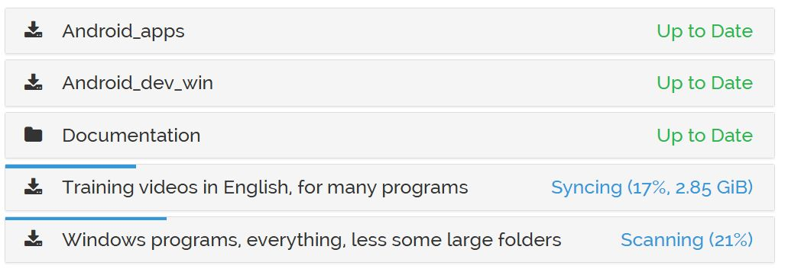

Last login: Wed Sep 16 17:20:14 on console
jim@jimhmac ~ %
jim@jimhmac ~ % cd SIL/Work/Computing/Collaboration/LangTechDepotDevelopment
jim@jimhmac LangTechDepotDevelopment % nf
drwxrwxrwx    2 jim  staff        64 19 Dec  2020 Output/
drwxrwxrwx    2 jim  staff        64 19 Dec  2020 archive/
drwxrwxrwx    3 jim  staff        96 16 Jul  2021 LangTranUpdate app for Vimeo/
drwxrwxrwx    4 jim  staff       128  2 Sep  2021 paratext.org/
-rwxrwxrwx    1 jim  staff     80494  2 Dec  2021 Ketarin-error-2021-12-02-A.txt*
drwxrwxrwx    5 jim  staff       160 17 Jan  2022 Mac/
-rw-r--r--    1 jim  staff      9380 21 Mar  2022 LangTran_icon-200px-white-bkgrnd.jpg
drwxrwsrwx  201 jim  staff      6432 11 Apr  2022 Sunk/
drwxrwxrwx    6 jim  staff       192 15 Apr  2022 NextCloud/
drwxrwxrwx   45 jim  staff      1440  3 May  2022 Problems/
drwxrwxrwx    6 jim  staff       192 14 Feb  2023 Synchronising/
drwxrwxrwx    8 jim  staff       256 16 Mar  2023 Ketarin recipes/
drwxrwxrwx   56 jim  staff      1792  3 Jun  2023 Vimeography/
drwxr-xr-x    4 jim  staff       128  7 Jun  2023 Index-a-site/
drwxrwxrwx   31 jim  staff       992  8 Aug  2023 BTSync_info/
-rw-r--r--@   1 jim  staff   1051619 19 Sep  2023 Importing Scripture into Paratext Using SILAS.pdf
drwxrwxrwx   37 jim  staff      1184 18 Jun  2024 Videos/
drwxrwxrwx   18 jim  staff       576 17 Jul  2025 charges/
drwxrwxrwx  144 jim  staff      4608 22 Jun 20:16 pix/
drwxr-xr-x    5 jim  staff       160 29 Aug 18:20 Slack/
drwxr-xr-x@ 301 jim  staff      9632 16 Sep 17:20 Extra/
drwxr-xr-x@  10 jim  staff       320 16 Sep 19:55 SyncThing-based-syncing/
jim@jimhmac LangTechDepotDevelopment % cd SyncThing-based-syncing/
jim@jimhmac SyncThing-based-syncing % ll
total 376
drwxr-xr-x@  10 jim  staff    320 16 Sep 19:55 ./
drwxrwxrwx@ 178 jim  staff   5696 15 Sep 17:22 ../
-rw-r--r--@   1 jim  staff  37094 15 Sep 18:26 Desired folder selection option 2026-09-15.png
-rw-r--r--@   2 jim  staff  43249 16 Sep 17:52 Folders-partly-updated.jpg
drwxr-xr-x@  13 jim  staff    416 16 Sep 19:27 ltd-repo/
-rw-r--r--@   1 jim  staff    192  7 Sep 15:42 My token.txt
-rw-r--r--@   1 jim  staff     23  7 Sep 15:13 My token.txt~
-rw-r--r--    1 jim  staff  27144 16 Sep 19:52 setup on windows asking for token again.jpg
-rw-r--r--    1 jim  staff    323 16 Sep 19:56 setup-for-Windows-asking-for-token.txt
-rw-r--r--@   1 jim  staff  61621 15 Sep 21:47 SyncThing offering folders to sync 2026-09-15.jpg
jim@jimhmac SyncThing-based-syncing % git status
fatal: not a git repository (or any of the parent directories): .git
jim@jimhmac SyncThing-based-syncing % cd ltd-repo
jim@jimhmac ltd-repo % git status
On branch main
Your branch is up to date with 'origin/main'.

Changes not staged for commit:
  (use "git add <file>..." to update what will be committed)
  (use "git restore <file>..." to discard changes in working directory)
	modified:   intent.md

Untracked files:
  (use "git add <file>..." to include in what will be committed)
	images/

no changes added to commit (use "git add" and/or "git commit -a")
jim@jimhmac ltd-repo % git diff intent.md
diff --git a/intent.md b/intent.md
index dd09e89..eccb66b 100644
--- a/intent.md
+++ b/intent.md
@@ -11,7 +11,7 @@ internet is poor, expensive, unreliable or absent.

 **Who it is for.** Anyone doing language work among minority languages. It is an open
 website, not an invitation list, and it is particularly meant to support language-based
-development and Bible translation. The software repository it distributes is SIL's; the
+development and Bible translation. The software repository it distributes is SIL's and includes other useful free software; the
 audience is not limited to SIL.

 **What their machines are like.** Around fifty field machines today, Windows and Linux,
@@ -54,6 +54,12 @@ you leave": there is no script to remember and no window to miss.
 last-synced summary, nothing that answers the one question that matters on the morning
 you pack. Continuous sync solves the forgetting; it does not solve the not-knowing.

+*That may be so for some program that we have invented, but the SyncThing GUI shows us when the folders we have selected are up-to-date.*
+
+
+*When all show "Up to Date", you are good to go. If we want people to use our program instead of the SyncThing GUI, yes, more work is needed. JimH44
+*
+
 ### G2 — You have the thing you didn't know you'd need

 The point of the depot is breadth carried cheaply, not a precise shopping list.
@@ -64,6 +70,7 @@ brings its whole contents. Taking more than you think you need is the default po
 **Gap.** Nothing makes the catalog legible *before* you need it. A folder announces
 itself with an ID and nothing else — no description of what is inside, no way to tell
 from the list whether the thing you half-remember hearing about is in there.
+This Gap is not correct. All shares now have a brief description of the contents, such as "Apps to install on an Android device" as well as the short name, "Android_apps" in this case.

 ### G3 — It lands where you want it, including a thumb drive

jim@jimhmac ltd-repo % git diff intent.md
diff --git a/intent.md b/intent.md
index dd09e89..2a4ac1a 100644
--- a/intent.md
+++ b/intent.md
@@ -11,7 +11,7 @@ internet is poor, expensive, unreliable or absent.

 **Who it is for.** Anyone doing language work among minority languages. It is an open
 website, not an invitation list, and it is particularly meant to support language-based
-development and Bible translation. The software repository it distributes is SIL's; the
+development and Bible translation. The software repository it distributes is SIL's and includes other useful free software; the
 audience is not limited to SIL.

 **What their machines are like.** Around fifty field machines today, Windows and Linux,
@@ -54,6 +54,12 @@ you leave": there is no script to remember and no window to miss.
 last-synced summary, nothing that answers the one question that matters on the morning
 you pack. Continuous sync solves the forgetting; it does not solve the not-knowing.

+*That may be so for some program that we have invented, but the SyncThing GUI shows us when the folders we have selected are up-to-date.*
+
+
+*When all show "Up to Date", you are good to go. If we want people to use our program instead of the SyncThing GUI, yes, more work is needed. JimH44
+*
+
 ### G2 — You have the thing you didn't know you'd need

 The point of the depot is breadth carried cheaply, not a precise shopping list.
@@ -64,12 +70,15 @@ brings its whole contents. Taking more than you think you need is the default po
 **Gap.** Nothing makes the catalog legible *before* you need it. A folder announces
 itself with an ID and nothing else — no description of what is inside, no way to tell
 from the list whether the thing you half-remember hearing about is in there.
+This Gap is not correct. All shares now have a brief description of the contents, such as "Apps to install on an Android device" as well as the short name, "Android_apps" in this case.

 ### G3 — It lands where you want it, including a thumb drive

 The default is a folder on your computer, but the user should be able to point it
 somewhere else — most usefully at a removable drive they can carry or lend.

+*When we select folders using the SyncThing GUI, we do have the option of choosing where each folder goes, and what it is called.*
+
 **Today.** The destination is a fixed root: `%USERPROFILE%\LangTechDepot` on Windows,
 `$HOME/LangTechDepot` on Linux.

@@ -91,6 +100,8 @@ came for.
 could search with Ctrl-F and then walk back up to the folder. Finding a known filename
 now means opening folders until you hit it.

+*Not true. The main folders that people would select contain copies of the file "LangTranDepotFiles.txt", which lists all files in the repo, from the perspective of the kind of software that it is (ie. the Groups folder view). Perhaps this should be adapted to show the folders from the perspective of the kind of user (ie. the BTSync folder view.)*
+
 ### G5 — A centre mirrors once; everyone else pulls over the LAN

 Where workers gather at a centre, one machine should pay the long-haul cost and everyone
jim@jimhmac ltd-repo % git status
On branch main
Your branch is up to date with 'origin/main'.

Changes not staged for commit:
  (use "git add <file>..." to update what will be committed)
  (use "git restore <file>..." to discard changes in working directory)
	modified:   intent.md

Untracked files:
  (use "git add <file>..." to include in what will be committed)
	images/

no changes added to commit (use "git add" and/or "git commit -a")
jim@jimhmac ltd-repo % git pull
Already up to date.
jim@jimhmac ltd-repo % gcm "intent.md, some corrections & an image. See issue #25." -a
zsh: command not found: gcm
jim@jimhmac ltd-repo % git commit -m "intent.md, some corrections & an image. See issue #25." -a
  1 # What LangTechDepot is for
  2
  3 CLAUDE.md says how this works. This says **why**, and what it must keep being true of.
  4 Read it before design decisions; the mechanism is negotiable, the goals are not.
  5
  6 ## What this is
  7
  8 A single place from which language workers get the current installers for the software,
  9 utilities and resources their work needs — and get them **before** they go somewhere the
 10 internet is poor, expensive, unreliable or absent.
 11
 12 **Who it is for.** Anyone doing language work among minority languages. It is an open
 13 website, not an invitation list, and it is particularly meant to support language-based
 14 development and Bible translation. The software repository it distributes is SIL's and includes other useful free softwa    re; the
 15 audience is not limited to SIL.
 16
 17 **What their machines are like.** Around fifty field machines today, Windows and Linux,
 18 no administrator rights, on links that are slow, metered, or intermittent. Every
 19 constraint below follows from that sentence.
 20
 21 ## The situation it exists for
 22
 23 You are in a village. You find a problem with your data in the dictionary program. You
 24 use a satellite phone or the mobile network to ask a colleague, and you get back:
 25
 26 > "The latest version fixes that problem. You did update before you left town, didn't
intent.md                                                                                                 1,1            Top
"intent.md" 212L, 11518B
  1 # What LangTechDepot is for
  2
  3 CLAUDE.md says how this works. This says **why**, and what it must keep being true of.
  4 Read it before design decisions; the mechanism is negotiable, the goals are not.
  5
  6 ## What this is
  7
  8 A single place from which language workers get the current installers for the software,
  9 utilities and resources their work needs — and get them **before** they go somewhere the
 10 internet is poor, expensive, unreliable or absent.
 11
 12 **Who it is for.** Anyone doing language work among minority languages. It is an open
 13 website, not an invitation list, and it is particularly meant to support language-based
 14 development and Bible translation. The software repository it distributes is SIL's and includes other useful free softwa    re; the
 15 audience is not limited to SIL.
 16
 17 **What their machines are like.** Around fifty field machines today, Windows and Linux,
 18 no administrator rights, on links that are slow, metered, or intermittent. Every
 19 constraint below follows from that sentence.
 20
 21 ## The situation it exists for
 22
 23 You are in a village. You find a problem with your data in the dictionary program. You
 24 use a satellite phone or the mobile network to ask a colleague, and you get back:
 25
 26 > "The latest version fixes that problem. You did update before you left town, didn't
intent.md                                                                                                 9,87-85        Top
Type  :qa  and press <Enter> to exit Vim
