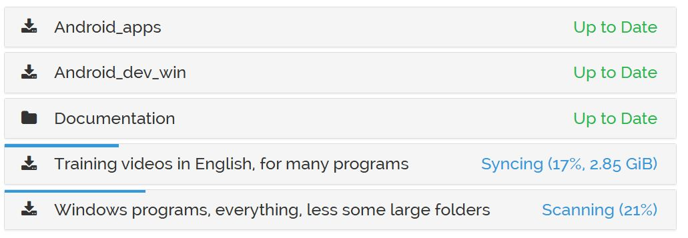

# What LangTechDepot is for

CLAUDE.md says how this works. This says **why**, and what it must keep being true of.
Read it before design decisions; the mechanism is negotiable, the goals are not.

## What this is

A single place from which language workers get the current installers for the software,
utilities and resources their work needs — and get them **before** they go somewhere the
internet is poor, expensive, unreliable or absent.

**Who it is for.** Anyone doing language work among minority languages. It is an open
website, not an invitation list, and it is particularly meant to support language-based
development and Bible translation. The software repository it distributes is SIL's, and
includes other useful free software from elsewhere; the audience is not limited to SIL.

**What their machines are like.** Around fifty field machines today, Windows and Linux,
no administrator rights, on links that are slow, metered, or intermittent. Every
constraint below follows from that sentence.

## The situation it exists for

You are in a village. You find a problem with your data in the dictionary program. You
use a satellite phone or the mobile network to ask a colleague, and you get back:

> "The latest version fixes that problem. You did update before you left town, didn't
> you?"
>
> "No. I was in such a rush getting everything done that I forgot to check."

Everything here exists to make that exchange impossible. The update had to happen while
the connection was good, without the user remembering to make it happen.

The second case is quieter and just as important. You hear that program X does your
current task far better than what you are using. You should not have to wait until you
are back in town — X should already be in your depot folder, because you took the whole
shelf when the connection was good, not just the books you knew you wanted.

## Goals

Each goal states the intent, how the system serves it **today**, and the honest **gap**.
An unmet goal is a commitment not yet kept, not an idea nobody had.

### G1 — You leave town already current

The update must not depend on the user remembering to update.

**Today.** Syncthing runs from logon — a per-user Task Scheduler task on Windows, a
per-user systemd unit with lingering on Linux — and keeps accepted folders current
continuously. This is strictly better than the original "run a script overnight before
you leave": there is no script to remember and no window to miss.

The question that matters on the night before you leave — *"am I ready to leave?"* — is answered by the item in your `LangTechDepot` folder called `Am I up-to-date, and advanced management.url`, which will open your browser at Syncthing's own page at `localhost:8384`: each folder shows its progress, and when every one reads **Up to Date**, you are good to go.

**Gap.** Only that page answers it, and nothing sends the user there for that reason —
neither the instructions site nor the installers mention it as the readiness check. If
the depot ever puts its own program in front of Syncthing's page, that program has to
answer the question too.

### G2 — You have the thing you didn't know you'd need

The point of the depot is breadth carried cheaply, not a precise shopping list.

**Today.** Every catalog folder is offered to every registered device, and accepting one
brings its whole contents. Both installers subscribe every device to `All_Contents_List`
first; it holds `LangTechDepotFiles.txt`, which lists every folder on offer with its size
and a short description (such as `Android_apps` — "Apps to install on an Android
device"), then every file in it. The installer's folder picker is built from that file,
so the user sees what each folder holds and how big it is before choosing, and can search
the whole list for the thing they half-remember.

**Gap.** The picker starts with every new folder unticked, and an unticked folder is
*ignored*, not merely skipped — so the default posture at step 4 is now to take less, not
more. Re-running the installer brings ignored folders back, but the user has to know to.
The descriptions also reach only the picker: a folder accepted straight from Syncthing's
own page shows whatever label the server gives it.

### G3 — It lands where you want it, including a thumb drive

The default is a folder on your computer, but the user should be able to point it
somewhere else — most usefully at a removable drive they can carry or lend.

**Today.** On Windows, a fresh install opens a folder picker for where the depot should
live — another drive or an external disk included — and saves the choice as Syncthing's
default folder path, so later runs and Syncthing's own **Add** dialog both start from it.
Syncthing's **Add** dialog also lets the user put any single folder elsewhere. On Linux
the root is fixed at `$HOME/LangTechDepot`.

**Gap.** Linux has no choice at all. On Windows the choice is made once: a later run
does not ask again, and Syncthing never moves a folder it has already created. The
thumb-drive story — run Syncthing portably from the drive itself, so the depot travels
with it — exists only as a suggestion in README.md's *Sneakernet* section.

### G4 — One installer, over the worst link there is

Some users rarely see a good connection. They need to fetch exactly one file, with no
web page, images, advertisements or "helpful" extras riding along.

**Today.** `depot.langtech.cloud/files` is a bare directory browse of the repository
tree, served by Caddy. No page weight, no scripts, nothing to download but the file you
came for.

The manifest is back: `LangTechDepotFiles.txt` sits at the root of `/files`, a flat list
of every file with its size and date, searchable with Ctrl-F, as the old system had it.
It is regenerated on the server, not by anything in this repo.

**Gap.** The manifest is itself about half a megabyte, which on the worst links is not
free. Nothing yet offers a smaller way in.

### G5 — A centre mirrors once; everyone else pulls over the LAN

Where workers gather at a centre, one machine should pay the long-haul cost and everyone
else should update over the local network for free.

**Today.** Both installers enable Syncthing's introducer mode, so the server introduces
field machines to each other and devices holding the same folder sync directly. On one
office LAN, only the first machine to want a file pulls it across the ocean.

**Gap.** That happens by accident of topology, not by design. There is no designated
mirror role, no way to nominate a machine as the local source, no guidance for the
support person who would run one, and no way to confirm from a client that the file
came from next door rather than from California.

### G6 — Picking what matches your kind of work is obvious

Different work needs different software. The user should be able to see which folders
are theirs without asking anyone.

**Today.** The catalog is organised by kind of work, and the user chooses at step 4 from
the folders offered. `CATALOG_FOLDERS` can narrow what the server offers, globally.

The installer's picker shows every folder with a one-line description and its size, and
the copy of `LangTechDepotFiles.txt` in `All_Contents_List` is arranged the same way —
by kind of user rather than by kind of software — so the list explains itself.

**Gap.** The folder list is still the entire affordance. There is no per-user or per-role
assignment and none is intended, so the one-line descriptions carry the whole job of
telling a user which folders are theirs.

> G2 and G6 pull against each other on purpose: **take more than you think you need**,
> *and* **make the choice obvious**. Both land on the same surface — the list of folders
> at step 4 — which is why folder IDs being permanent and legible is a design rule and
> not a housekeeping convention.

### G7 — The interface is the instructions

The old system needed a setup PDF that users had to be sent, keep, and choose from. That
is the shape this goal exists to make unnecessary.

**Today.** Four illustrated steps on the instructions site, plus the pages `register.py`
renders. Nothing has to travel with the user, and nothing has to be kept in sync by hand.

**Gap.** None structurally — but this goal is a standing test rather than a finished
feature. **If the answer to a usability problem is ever "write a document and send it to
people," the design has failed.** Fix the screen the user is already looking at.

### G8 — You can recommend software worth adding

A user who finds an open-source tool that other language-technology workers would
benefit from should be able to say so.

**Today.** Nothing yet. LTUse curates the folder contents. The intended path back to them
is `depot@langtech.cloud`, which LTUse will watch, advertised on the site — but the
mailbox does not exist yet (see #15).

**Gap.** Until it does, nothing on the site, in `register.py`, or in either installer
accepts a suggestion. This is the only goal here with no implementation at all.

## What follows from this

Standing rules. Each names the goal it serves, so it can be argued with rather than
merely obeyed.

- **Bandwidth is the scarce resource, not developer time.** No web fonts, no bitmap
  images, no CDN, no build step, no framework — inline SVG and one stylesheet. A page
  that costs the user money to read has failed before it is read. (G1, G4)
- **Every step must be resumable.** A dropped connection must never mean starting over,
  and nothing may require one uninterrupted session. The user can stop after any step
  and come back later. (G1)
- **Never require administrator rights.** Rules out installing a system service, writing
  outside the user's profile, or elevating for any reason.
- **No licensed dependency, ever.** Resilio Business can no longer be downloaded and no
  new licences can be had — that, not a technical failing, is what killed the previous
  system. Anything this project depends on must be freely obtainable now and in five
  years.
- **Never answer a usability problem with a document.** No setup PDF, no README handed to
  a field user, no "see the instructions" that is not already on the screen in front of
  them. (G7)
- **Folder IDs are what users read.** They are permanent and must be legible to a
  non-technical person scanning a list, even with a description beside each one.
  Renaming a published one breaks every `modify-langtechdepot` and
  `langtechdepot-subscribe` invocation, every device's ignore list, and every user's
  mental map. (G2, G6)
- **Keep `/files` a bare tree.** Do not put a catalog browser, search UI or landing page
  in front of it; that reintroduces exactly the page weight it exists to avoid. The right
  answer to G4's missing manifest is a plain text file, not an application. (G4)
- **Receive-only is a promise, not a default.** Nothing on a field machine is ever sent
  anywhere. Any design that touches sync direction must preserve that and must say so in
  the copy, because the user has to believe it as well as benefit from it.
- **The user is in a hurry and not technical.** Ten minutes, four steps, stoppable after
  any one, and never sent to a GitHub page.

## Who decides what is in it

**LTUse curates the folder contents.** This repo is the distribution layer and has no say
in the catalog. What it owes: permanent folder IDs, so curation never breaks a user's
subscription, and eventually a way for users to recommend something worth adding (G8).

## Non-goals

- **Not a package manager.** It delivers installers; it does not install, update or
  manage the software inside them.
- **Not backup, and not two-way sync.** Files move outward from the repository only.
- **Not general file sharing.** The catalog is curated, not user-populated.
- **Not a web application.** The instructions site is static files and stays that way.
- **No protocol code.** Syncthing does the syncing. This repo is a thin layer around it.

## Names

**LangTechDepot** is current; **`depot.langtech.cloud`** is the hostname. *LangTran*,
*LangTranSync*, *LangTranLocal*, `langtechdepot.lingtransoft.info` and
`files.lingtransoft.info` are dead — recorded here only so old references can be
recognised for what they are. See CLAUDE.md's *Traps* for which of them are actively
dangerous to reintroduce.
